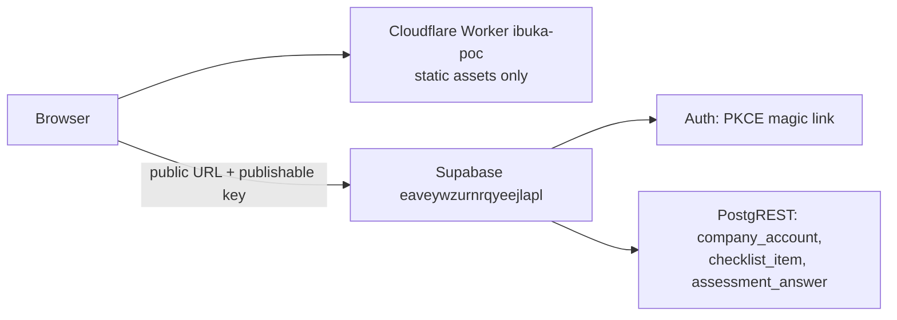
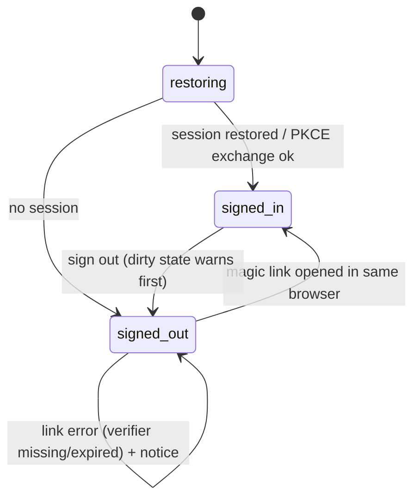

# CMP Kenya technical guide

## Branding release verified — 1 October 2026

Released through PR8: runtime merge `a2ee8f271d8437a876964fe5fc1dd3d85c4ccf86`, implementation `558507c0f655c6601fcffda2f4ec859b4fb791f6`. Existing KASIB production Workers Build `b27a6f5c-3017-41d7-afe6-61a322d2fa38` succeeded for that exact merge. Both https://cmpkenya.co.ke and https://ibuka.co.ke returned HTTP200 and byte-identical reviewed JS/CSS, four supplied logo variants, original favicon and two local fonts (nine checks per origin). Font-ready desktop1440 and phone390/320 preview screenshots were inspected. Worked-example/reset and sign-in-dialog open/Escape checks passed on both live origins; no hosted writes or email requests were made.

Local validation: unit fixtures, production typecheck/build and privacy passed. All17 original UI scenarios passed in the final full-suite run; the final branding test file passed all6 additional scenarios in its affected repeat after correcting keyboard modality probes. Original tests/business logic remained unchanged. Parent source checks found46 protected files byte-identical and one prepared-panel class-only decorative change. Fresh independent GLM blind/reveal plus final evidence comparison passed the local candidate; this pass has no review waiver. Actual route: Z.ai Coding Plan GLM draft, GPT bounded fallback after initial plus resumed timeouts, fresh GLM review. No metered fallback.

Scope: supplied working branding for the walkthrough; client content/brand approval and professional finishing remain open. Existing Astra workspace type sizes/600 heading weight are a deliberate adaptation of the guideline type scale. The original source prompts/options, saved preparation meaning and API/auth/database/infra behavior are preserved; no guideline readiness bands, new report, upload or marketing landing page is introduced. Signed-in UI evidence is mocked locally; older real-stack evidence is historical, not a new real-email/RLS claim. Albie's landing-page/upload/remaining-dashboard work is separately planned for5–9October with exact completion/review dates still TBC.

## Supplied branding candidate — 1 October 2026

For the 2 October walkthrough, the supplied CMP Kenya Brand Identity Guidelines v1.0 (October 2026) supersede the previous placeholder identity and red accent. Original horizontal/logo-icon SVGs are served byte-for-byte from `public/brand`; the original primary icon is also the favicon. The navy rail uses the reversed horizontal lockup at 124px; the small-screen preview uses the primary horizontal lockup at 124px; signed-in company context uses the primary icon at 24px. The 88px mobile/rail header conservatively reserves half the displayed artwork height as clear space. Browser favicon dimensions are platform-controlled.

Palette: Portal Navy `#0B2545`, Listing Green `#0A7A53`, Mist `#F3F6F9`, White, Slate `#4A5568`; gold/mint are restrained accents. Gold is decorative on white. Keyboard focus uses green on light surfaces and mint on the navy rail. Montserrat headings/actions/numbers and Source Sans 3 body fonts are self-hosted WOFF2, unmodified, with OFL licences alongside them and Arial fallback; no font CDN is used.

Source binding: DOCX SHA256 `bbea6b1a3676194aab2333878bb623058028e0030b00a82d828ec8bcceecebb9`; logo ZIP SHA256 `bbba75d524e698e89962ea74a31f50d0bd850d7a9a2e766aa39c515704f5b14f`. Guidelines §§2–5 govern the supplied name, descriptor, tagline, artwork, colours and fonts. The ten source prompts/options, scoring, saved-only preparation semantics, autosave/auth/API, sample files and infrastructure configuration remain unchanged. Guideline §4.1 readiness bands conflict with existing preparation semantics and are deferred; §7 landing-page/report mock-ups are references, not new functionality. Brand-owner approval and professional finishing under §9 remain open.

Actual route: GLM-5.3 through the Z.ai Coding Plan drafted implementation; its initial attempt and one resumed attempt timed out. GPT completed bounded presentation/probe corrections under the handoff failure rule. A fresh GLM blind review is recorded; candidate comparison, production release and actual live checks must be bound to this revision before calling this pass released. The September UI-pass review waiver does not apply to this branding pass. Local mock UI checks are presentation evidence, not new RLS or real-email verification. No hosted data or infrastructure is changed.

Previous issuer design verified live on 30 September 2026: app runtime revision `5ccf45ccfb9e761b7052fdfd32e1710b6797a330` (PR6; implementation `5396702d64ecf92990daac457b4f313b2ea35dbf`). Database runtime migrations remain from source `411f672bb971c021226228aa81b4837ddd17d187`; later database documentation is at `6edffaf58c30baaada9c7a719cd5b4f047f7696d`. Both https://cmpkenya.co.ke and https://ibuka.co.ke serve identical reviewed assets from the existing KASIB Worker. Companion release steps: [release-runbook.md](./release-runbook.md); database source: [ibuka-supabase](https://github.com/KASIB-KE/ibuka-supabase). Documentation-only revisions do not change these verified runtime assets.

## 1. Runtime architecture

Static React 18 single-page app, built by Vite 5 (`npm run build` → `dist/`), served as plain static assets by the existing customer-created Cloudflare Worker `ibuka-poc` via Workers Builds on the KASIB account. No server-side code runs in the Worker; the browser talks directly to Supabase using only the public project URL and publishable key (`src/config.ts`, committed as `vars` in [`wrangler.jsonc`](../wrangler.jsonc), bridged into the build by [`vite.config.ts`](../vite.config.ts)). The browser is untrusted: every privilege is enforced by the database (grants + RLS), never by hiding UI.

- Supabase project ref: `eaveywzurnrqyeejlapl` (Auth + PostgREST data API; same backend for ibuka and cmpkenya today — **no dev/prod data-isolation claim**).
- Domains: `cmpkenya.co.ke` is active and attached to the existing Worker; `ibuka.co.ke` remains attached. Auth Site URL is `https://cmpkenya.co.ke/`, with both exact origins allowed with and without the trailing slash. These settings were applied and read back; all 18 unrelated settings remained unchanged. Real SMTP/PKCE sign-in, clean callbacks, autosave, Ready status and reload persistence passed on both origins. The origins currently share one Worker and one Supabase project; separate environments are deferred.
- Entry points: `index.html` → `src/main.tsx` → `src/App.tsx` (anonymous preview + sign-in + signed-in workspace).

### Auth state (PKCE, same browser)

`src/lib/supabase-client.ts` creates the SDK client with `flowType: "pkce"`, `detectSessionInUrl: false`. `src/lib/auth-session.ts` performs one explicit `exchangeCodeForSession(code)` per client: the verifier lives in this browser's storage, so a **missing verifier is also a failure** (honest message, recovery = fresh link in the same browser), as are expired/used links. `code`/`error*` parameters are stripped from the URL afterwards regardless of outcome. Sign-in requests `emailRedirectTo: window.location.origin`; a cross-origin 301 would break PKCE, so both exact cmpkenya/ibuka origins must remain allowlisted. Anonymous sessions are excluded from all app policies. Data requests go through `getAccountDataClient()`, which captures the user id and re-checks the live session per token fetch, so a queued request from an old account cannot borrow the next user's token.

### Save state (autosave)

Edits debounce 800 ms; saves are serialized per item via a promise chain; success is only ever reported from the server-acknowledged row. See §4.

## 2. Catalogue and the enabled sample

The full supplied catalogue — 197 entries: 41 narrative prompts, 126 structured fields, 30 document requirements — stays **outside the browser** in `input/catalogue-source.json` (private). The reviewed selection ([`catalogue/sample-config.json`](../catalogue/sample-config.json)) enables exactly 10 items in four sections, sample version `2026-09-cmp-sample-2` (source revision "CMP workbook v2 observed2026-09-30").

[`tools/generate-sample.mjs`](../tools/generate-sample.mjs) (`npm run sample:generate`) validates the selection against the source (unknown/duplicate/unsupported IDs, enum agreement, source hash) and emits:

1. [`src/lib/generated/enabled-sample.json`](../src/lib/generated/enabled-sample.json) — the only sample data the bundle contains (enabled items only; camelCase `sampleVersion`/`sections`/`items` shape consumed by `src/lib/enabled-sample.ts`);
2. the reviewable DB seed migration `20260930000100_cmp_sample_v2.sql` (ibuka-supabase repo);
3. [`catalogue/generated-manifest.json`](../catalogue/generated-manifest.json) — counts plus sha256 of source, config outputs and seed.

[`tools/check-privacy.mjs`](../tools/check-privacy.mjs) (`npm run check:privacy`) proves over `dist/` that no source maps, unselected IDs or unselected prompts ship. **Not built** (later scope): full form coverage, repeatable-table workflows, a document vault, template/document generation. The ten items: Company details (CP-01 text, CP-07 date, CP-13 select MIMS/SMEMS), Financial position (SC-03 currency, CP-16 currency+date), Business (Q-BUS-01, Q-BUS-03 narrative), Risk and outlook (Q-RISK-01, Q-FIN-02, Q-FIN-03 narrative).

Changing the selection changes the sample version and requires the paired set: a new additive migration sorting **before** a freshly generated seed, regenerated runtime JSON, updated tests, and content validation. Readiness states are self-reported preparation for review — never regulatory approval or listing eligibility.

## 3. Data model, RLS and sample history

Three tables (migrations `20260927000100` schema / `20260927000200` v1 seed, extended by `20260930000050` + `20260930000100`): `company_account` (one per user, unique owner), `checklist_item` (read-only reference data), `assessment_answer` (one row per company+item; typed columns `answer_date`, `answer_bool`, `answer_text`, `answer_number`, `answer_select`, `na_reason`, plus `status`). Row shapes: [`src/lib/app-data/types.ts`](../src/lib/app-data/types.ts).

- anon: no grants, no policies — sees nothing. authenticated: own company/answers only; **no DELETE** anywhere; ownership/keys/timestamps immutable via narrow column grants (clients write only `name`, or status + typed values).
- History: sample v1 (`2026-09-b02-provisional-1`) had CP-07, Q-DIR-01, Q-ISS-01, Q-OFR-03. v2 retains only **CP-07** (same date control, re-activated in place). The three retired definitions are deactivated (`is_active = false`), never deleted: hidden by the read policy and unwritable via the validation trigger, while their historical answers remain readable to their owners. The dated 2026-09-27 migrations are immutable; the new extension migration sorts before the generated seed.
- Publication guard: reads and the answer trigger check the item against the **currently published active version** (`app.sample_release` / `app.current_sample_version()`), not any client-request version — clients send none. A retained-item (CP-07) write from an old client therefore cannot be distinguished and keeps unchanged semantics: it is validated against current database state. The denominator changes 4 → 10 with no rescoring; old and new scores are not comparable.
- Finite-amount validation (`answer_number` excludes NaN/±Infinity, ≥ 0) lives in schema migration `20260930000050_cmp_sample_v2_schema.sql` (sha256 `723a3b5b150b69c1e60e41688ecd37b9a7d36aa689089d370e91ab2e312347a1`) and is **verified locally**: `npm run db:test` exit 0 — 53 REST/Auth checks (including POST+PATCH non-finite regressions) plus 16 populated-upgrade checks (30 September 2026). Applied to the hosted database; all 53 ordinary Auth/PostgREST checks passed there too, including locale-sensitive NBSP cases. The 16 populated-upgrade checks are local verification of historical-answer preservation.

## 4. Autosave and answer semantics

Pure logic: [`src/lib/autosave.ts`](../src/lib/autosave.ts) and [`src/lib/app-data/answer-state.ts`](../src/lib/app-data/answer-state.ts); wiring in [`src/components/saved-assessment.tsx`](../src/components/saved-assessment.tsx) (loaded checklist + answers, save chain, guards).

- 800 ms debounce; per-item serialization; network failures retry at 1 s then 3 s, stopping after bounded attempts with an explicit Retry (manual retry resets the budget).
- A late acknowledgement re-dirties: if the draft changed while the request was in flight, the ack compares the current draft against the confirmed row and re-queues. Identity/load epochs drop stale responses (reload, account switch); `beforeunload` and a cancellable `cmp-before-signout` event warn while anything is dirty or saving.
- Editing a Ready item demotes it to draft; Ready is only offered when the typed answer is adequate. A draft failing `answerWriteIssue` is **never posted**: it rests in a stable "Needs attention" state outside the automatic queue until corrected or retried.
- Number semantics matter: queueing uses strict textual change (`answerTextChanged` — "5000" → "5000 " re-queues), while draft-vs-saved comparison uses semantic numeric equality (`answerDirty`) so a server-canonicalised `1.00` → `1` round-trip settles instead of rewriting forever.
- The anonymous preview ([`src/components/review-preview.tsx`](../src/components/review-preview.tsx)) is memory-only: no autosave, reload resets. Signing in starts the saved assessment; preview entries are **not** transferred.

## 5. Email (Resend SMTP)

Host `smtp.resend.com`, port `465`, user `resend`, sender `CMP Kenya <no-reply@cmpkenya.co.ke>`; the API key was entered by the user directly in the dashboard and must never appear in this repo, the browser or logs. Verified by dashboard readback: Resend shows `cmpkenya.co.ke` status Verified with a Domain verified event, and Supabase custom SMTP is enabled, persisting after reload with the stored password masked. Verified live on both origins: email received from the configured CMP Kenya sender, same-browser PKCE exchange, correct-origin redirect, credentials removed from the callback URL, typed-answer and Ready-state reload persistence, and sign-out clearing the workspace. Test data was synthetic; keys, links and tokens were kept out of logs.

## 6. Earlier baseline verification (before the issuer design refinement)

Verified on 30 September 2026:

- Local: unit/build/privacy/diff checks exit 0; 8 mock UI tests, 6 real Auth/Mailpit/PostgREST browser tests, 53 REST/Auth checks and 16 populated-upgrade checks pass.
- Hosted: both reviewed migrations are in the remote history; 53 ordinary-session access checks pass. Workers Builds production build `b4b02fbf-874a-49b4-909d-0ef28592310d` succeeded for app revision `336c2314...`. Both live hostnames serve JavaScript/CSS byte-identical to the reviewed build.
- Live browser: delivered SMTP email, same-origin PKCE, clean callback, typed autosave/reload, Ready-state persistence, narrow-screen layout and sign-out pass on both origins. Anonymous preview progress remains temporary; saved progress uses confirmed rows.
- Independent GLM-5.3 blind resolutions and candidate comparisons completed for backend and UI; this is a separate attempt on the same model/provider, not model diversity. Runtime proof is from the actual checks above.

Open business work: Trevor's validation of the selected questions/content and agreed examples, the wider requirements matrix, template/dictionary conflicts, and formal acceptance/handover. The full 197-entry catalogue is retained internally; full repeatable-table forms, document vault and template generation remain later scope. User journeys are the next product review. Deployment does not imply regulatory validation, contractual acceptance or completion of Phase 2.

## Issuer journey and guidance refinement — 30 September 2026

Design v2 is live at the runtime revision above; version-specific evidence is recorded below. Astra supplied the design; GLM-5.3 produced the initial guidance/target-guard draft. Its correction attempt hit the Coding Plan five-hour quota limit, so Codex completed implementation under the bounded failure fallback. Barak explicitly waived the independent GLM candidate review **for this current UI/guidance/test-workspace pass only**. Review is waived, not completed; all source, regression, visual and live checks remain required.

### Permanent source rule

Before every material change to wording, options, status meanings, scoring, onboarding or user flow, read the relevant current Trevor source sections and recorded decisions. Record the source/version/section and classify alignment, an unspecified design choice or a conflict. Preserve source IDs and verbatim prompts; keep product guidance separate. Surface unresolved discrepancies rather than silently choosing. Verify the changed behaviour and update the technical/task evidence. Passing tests or a deployment do not imply content approval.

### Source decisions

Sources checked: CMP Kenya Review and Confirmations v2, Trevor review D02/D03 and Context D06/D09/D11 (30 September snapshots); the complete body/table text of `IBUKA_Sample_Templates.docx` (received 30 September) and `ipo-platform-template-library.docx` (received 29 September). Sheet coverage rows still describe parts of the older four-item sample. They do not prove approval of the ten-item selection.

- D02 requests key questions; the ten-item selection stays proposed pending Trevor's validation. Prompts/IDs/stored options remain unchanged.
- Template 4 §7.1 supports material products/services and relative revenue importance; §7.4 requires the most recent historical financial period reported, by business segment/geography. Those constraints guide separately authored help.
- CP-07 incorporation is distinct from continuous operating history (Context D06). Document discrepancies need clarification; the UI does not silently adjudicate them.
- Q-RISK-01 retains the narrower prompt about measures the board has put in place; Template 4 §8.2's intended mitigation wording does not broaden answer adequacy.
- D03's ready/applicable formula is retained. None of the current ten allows N/A. Saved-only counts use acknowledged rows; incomplete drafts stay gaps.
- Navigation, hierarchy, next-question focus and mobile composition fill unspecified product-design gaps. The new help is proposed product guidance, not approved regulatory wording.

### Interaction and modules

`src/lib/selected-guidance.ts` contains help for only the ten enabled IDs. CP-13 displays full MIMS/SMEMS names with unchanged stored values and no automatic choice. `assessment-fields.tsx` associates help and distinct compound errors with their inputs; source disclosures remain available. Ready is one explicit action after an adequate answer; edits demote it to Draft. Clean per-item saved chips and the repeated ready paragraph have been removed; the aggregate acknowledgement is authoritative.

`use-question-navigation.ts` switches to the containing section and focuses the chosen input after rendering. `prepared-panel.tsx` provides linked remaining items, integrated into the desktop navy rail. A saved all-ready summary offers review only when there are no dirty, pending, failed or invalid changes; preview completion has separate temporary wording. Mobile progress remains compact, with remaining items disclosed; the first drafting input is checked at 390×844 and action targets remain at least 44px. Preview tools are disclosed, and temporary/nontransfer/reload behaviour stays visible. Onboarding's test-company display name does not auto-fill the legal-name answer.

The existing debounce, validation, serialization, stale-response guards, identity-bound API and dirty-exit warnings remain intact. `playwright.ui.config.ts` takes optional `CMP_UI_PORT` (default 55473); this worktree uses 55483. `playwright.config.ts` excludes **all** `ui-*.spec.ts` so the real-stack suite remains separate from mocked tests.

### Test backend and later production

Both HTTPS domains and build previews currently target the same existing synthetic test project `eaveywzurnrqyeejlapl`; hostname roles do not separate databases. Real controlled tester emails are account identities; company answers must be fictional. State-specific Test workspace notices appear in preview, onboarding and saved views.

`src/lib/project-url-guard.ts` allows only the exact canonical hosted origin `https://eaveywzurnrqyeejlapl.supabase.co` or HTTP/HTTPS loopback for local tests. Userinfo, unexpected hosted ports, paths, query/hash, spoofed hosts and other hosted projects are rejected. `src/config.ts` disables Auth/data initialization for an unknown target, including build-env overrides. This prevents accidental target changes; it cannot classify typed text as fictional or replace RLS. No service keys are exposed.

Supabase supports separate projects and isolated branches; persistent branches can serve long-lived staging. Before real-company use, provision a distinct backend through reviewed Terraform plan/apply, apply reviewed migrations, start with clean permitted seeds, configure separate URLs/public keys/Auth/SMTP and review the app guard. Do not copy tester users/answers into production. No new resource, migration, reset or environment has been created in this pass.

### Explicit later gaps

The full template engine, repeatable entities, signed-document vault, expert Verified status, adviser/admin collaboration, client content validation and formal acceptance remain open. Template/dictionary conflicts include SH-02 (nationality vs share counts), CP-18 (confirmation date vs dividend-waiver flag), Q-OFR-02/03 (proceeds/foreign-listing options vs allocation/sensitisation), absent Q-DIV-01/02 and undefined subfields. The sample's unselected allocation choices conflict with the library's default; financial periods and statutory responsibility/disclaimer text also require reconciliation before generation. These tags must not repurpose historical answers.

Design reference: [Jakub Krehel, Details that make interfaces feel better](https://jakub.kr/writing/details-that-make-interfaces-feel-better), read 30 September 2026. The existing antialiased type, stable tabular figures, subtle layered shadows, restrained transitions and 44px hit areas follow those details. The issuer information hierarchy and source constraints come from this project's design/source review. No third-party assets or skills were installed.

The screenshot review added a quieter guidance hierarchy: questions remain primary; only a short subtitle is visible by default, with secondary entry tips disclosed on demand. Financial amount/date inputs share a desktop row; numeric placeholders indicate an empty amount instead of looking like a entered example. Readiness uses an outline action and missing-input hints appear after interaction; actual typed-value errors remain visible and associated with their controls. This fills unspecified presentation gaps; source wording, adequacy, stored values and scoring remain unchanged.

### Section-led document composition (Astra v2)

The desktop workspace has a full-height 232px navy rail and a white utility header. Company identity is contextual; the active section title leads at 40px. One continuous white document has ruled 32/68 prompt/answer rows, larger 52px controls and a section continuation footer. Business/risk narrative rows stack the exact prompt over a full-width 180px textarea. Source IDs remain visible; secondary guidance and provenance share a disclosure. Essential numeric-format requirements, amount/date pairing and validation errors remain visible.

CP-13 uses native radio rows with both full segment names visible and no default, storing the existing MIMS/SMEMS enum. Narrative controls are labelled by their exact prompt rather than a duplicated short heading. Readiness appears once below the input; empty entries have no redundant Not started badge. Progress is a saved-ready count and linear track in the navy rail, with remaining-item focus links; there is no separate right-hand progress card or percentage hero. Review completion remains gated on acknowledged answers with no pending/failed/invalid edits.

`workspace-slots.tsx` moves presentation into utility/rail slots using React portals. It retains the assessment's state/handlers and changes location on the 1024px media query, with listener cleanup. It does not alter Auth, persistence, API requests or ownership. Header context truncates long names; mobile rows stack, and section navigation stays in normal flow. Local system fonts and existing accessible primitives are used; no dependency/service additions.

### Design v2 release evidence

Workers preview build `3a4a7409-2b78-4f12-8175-e3989807210f` succeeded for candidate `5396702...`; production build `2908f8fb-b3f8-4c23-a2d9-ddbabceefc3b` succeeded for merged runtime `5ccf45c...`. On 30 September at 14:17 UTC, both public hostnames returned 200 and served byte-identical reviewed assets:

- JavaScript `/assets/index-C-FTAWmf.js`, SHA256 `a10c2d478f6f589f15948446c46dff56b10f32bcee8673be97fa1920e4c147fa`.
- CSS `/assets/index-B2tRmdkz.css`, SHA256 `126e0cfda29c142c0f2afd7777d7cadda356ec03a9ac84d8afdf5323a2ad7d8e`.

Unit/build/diff checks pass; the strict privacy scan passes 935 unselected-ID and 935 prompt checks over 187 unselected entries and five scan files, with its existing Date/Total assets collisions recorded. The ten generated definitions remain byte-identical to source-checked base `22f4ad23...`. The visible compound-control sublabel is Asset amount; no unselected definition is imported for that label.

All 17 UI scenarios were verified: the full final run passed 16, with a slow numeric-settling timeout passing its isolated repeat. The final mobile footer/count layout passed three affected scenarios, and the final compound-label refinement passed the financial scenario. All six real local Auth/Mailpit/PostgREST scenarios pass. Desktop financial/company/narrative and 390×844 mobile renders were inspected, including actual errors, long names and fully visible footer controls. Measured normal-text contrast is at least 5.5:1 for the main/rail/action palette.

At 14:19 UTC the deployed CMP journey passed actual configured-sender email delivery and same-browser PKCE, cleaned callback URL, display-name/legal-answer separation, typed autosave/reload, Ready persistence, remaining-question focus, long-name mobile first-input visibility/no overflow and sign-out clearing. No page errors were observed. Both hostnames continue to use the same existing synthetic backend. Controlled fixture cleanup is tracked separately and touches only the owned tester's rows; other data is preserved.

The independent GLM candidate review remains **waived for this scoped pass**, as explicitly requested. Source fidelity, tests, visual inspection and served-artifact/live-flow checks supplied the release evidence. This release completes the issuer UI refinement; content validation, broader template work and contractual acceptance remain open.
